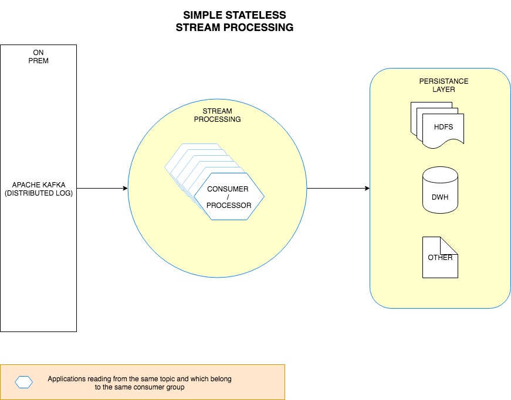

# Spring Kafka Json [Consumer]() Prototype

This application is just a prototype on how we can consume json messages from a [kafka](https://kafka.apache.org/) topic which could have a high through put level.
However, every change in schema would require a new DTO (Data tansfer object to be created) which acts as a service contract between the producer and processing application.

> Note: This is just a prototype and is not yet ready for production. Operations related stuff still has to be in-corported. This can be easily achieved using springs [Actuator](https://spring.io/guides/gs/actuator-service/) project and other options provided by spring. If you are going to run this in containers would be good to include a [service registry](http://microservices.io/patterns/service-registry.html) to effectively operate the application.

## Dataflow diagram



## Prerequisites

* JDK 1.8 
* Kafka 0.9.0.0 +
* Zookeeper
* Postgres 9.4 +

## Set up process

Clone the repo and run the following to build the project

```sbtshell
cd /root/directory

mvn clean install
```

Make sure you have access to a Kafka cluster. If not please follow the instructions [here](https://kafka.apache.org/quickstart)

Once the build is sucessfull, run the following command to start the application

```sbtshell
java -jar target/*.jar
```

The application should be up and running on port 10001

> Note: You can externalize your applications config too. If you would like to make changes to the config please refer to [this](https://docs.spring.io/spring-boot/docs/current/reference/html/boot-features-external-config.html)

## How to check if data is being consumed?

There should be a table created in postges with the name of the entity specified in the application. This table would have the data consumed from kafka.

In scenario's where the through put is high, its not recommonded to fluch out a record at a time because of the I/O performence issues with RDBMS's. Alternatives to this approach are:
* Use Cassandra / Rocks DB which can facilitate high throughputs, because these are append only data compaction enabled databases which would result in good write throughput. Where as RDBM's are meant for good read performences.
* Write to a Distributed file system like HDFS
* If you would still like to use a RDBMS, make sure you pool records up for a certain time interval and write a micro-batch of data at a time. This makes your application stateful and hence you would have to battle with issues around failover and Idempotency.

Check the [Kafka Producer](https://github.com/reddy-s/spring-kafka-json-producer) for posting json data into kafka
